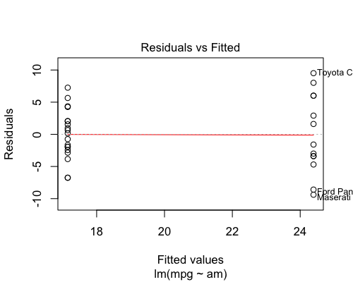
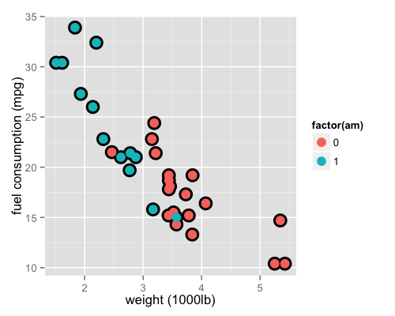
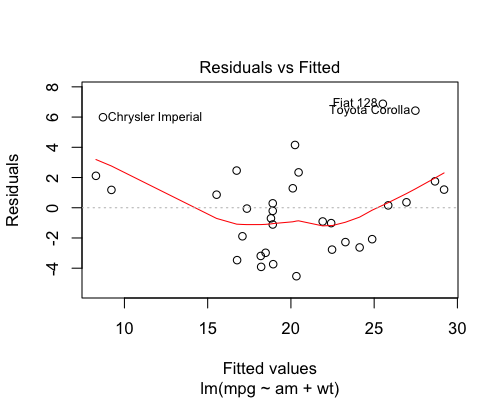
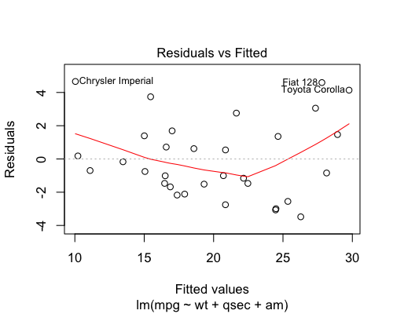

### Analysis of the effect of manual vs automatic transmission on car fuel consumption


#### Executive Summary
The aim of this analysis is to determine whether manual or automatic transmission provides better fuel consumption (i.e. more mpg), based on the mtcars dataset. I have investigated several linear models in order to  determine whether the effect of transmission type is significant, and if so, which type produces higher mpg. The conclusion is that if mpg is modelled as a function of car weight, car quarter mile time and transmission type, that manual transmission cars tend to have better fuel consumption.

#### Exploratory Analysis
The data set includes 11 variables: mpg, cyl, disp, hp, drat, wt, qsec, vs, am, gear, carb. The outcome variable is mpg. The other variables are possible predictor variables. Transmission type is a two factor variable labelled am, where 0=automatic and 1=manual. As a starting point, consider a simple model of mpg against am alone.

```r
c1<-summary(fit1<-lm(mpg ~ am, data=mtcars))$coef; c1
```

```
             Estimate Std. Error   t value     Pr(>|t|)
(Intercept) 17.147368   1.124603 15.247492 1.133983e-15
am           7.244939   1.764422  4.106127 2.850207e-04
```

The Pr coefficient for am is 0.000285, so at the P=0.05 significance level, this might imply transmission type does strongly affect mpg. (Residual plot for this model shown in Appendix, Fig 1). However, consider Fig 2 in the appendix: mpg plotted against wt. This plot shows that in this dataset, manual cars tend to be lighter than automatic cars. In other words, wt is a probable confounding variable in the simple model above. So let's include this variable in the model too: 


```r
c2<-summary(fit2<-lm(mpg ~ am + wt, data=mtcars))$coef; c2
```

```
               Estimate Std. Error     t value     Pr(>|t|)
(Intercept) 37.32155131  3.0546385 12.21799285 5.843477e-13
am          -0.02361522  1.5456453 -0.01527855 9.879146e-01
wt          -5.35281145  0.7882438 -6.79080719 1.867415e-07
```

Now with wt included in the model, the estimate of the influence of am on mpg has dropped to -0.0236 with a P value of 0.988, which is no longer significant at the P=0.05 level. Residuals for this model are also shown in the appendix (Fig 3). In this case the residual plot shows there are certain outlier points (Chrysler Imperial, Fiat128, Toyota Corolla) that seem to be affecting the distribution. Examining the dataset more closely, we can compare these cars with others that have similar mpg, wt and the same am level but lower residuals:


```
              mpg cyl disp  hp drat    wt  qsec vs am gear carb
Honda Civic  30.4   4 75.7  52 4.93 1.615 18.52  1  1    4    2
Lotus Europa 30.4   4 95.1 113 3.77 1.513 16.90  1  1    5    2
```

```
                   mpg cyl disp  hp drat    wt  qsec vs am gear carb
Chrysler Imperial 14.7   8  440 230 3.23 5.345 17.42  0  0    3    4
Duster 360        14.3   8  360 245 3.21 3.570 15.84  0  0    3    4
```
Many of the other variables are similar too. Those that seem to differ in both examples, perhaps indicating some influence on mpg, are disp and qsec. Let us explore the effect of adding these into the models.

```r
summary(fit3a<-lm(mpg ~ am + wt + disp, data=mtcars))$coef
```

```
               Estimate Std. Error    t value     Pr(>|t|)
(Intercept) 34.67591088 3.24060891 10.7004306 2.115200e-11
am           0.17772414 1.48431586  0.1197347 9.055483e-01
wt          -3.27904388 1.32750927 -2.4700723 1.986658e-02
disp        -0.01780491 0.00937465 -1.8992613 6.787740e-02
```

```r
summary(fit3b<-lm(mpg ~ am + wt + qsec, data=mtcars))$coef
```

```
             Estimate Std. Error   t value     Pr(>|t|)
(Intercept)  9.617781  6.9595930  1.381946 1.779152e-01
am           2.935837  1.4109045  2.080819 4.671551e-02
wt          -3.916504  0.7112016 -5.506882 6.952711e-06
qsec         1.225886  0.2886696  4.246676 2.161737e-04
```

```r
a1<-anova(fit1,fit2,fit3a)
a2<-anova(fit1,fit2,fit3b)
```
Looking at the P values for the anova tests above allows us to assess whether the extra variables have a significant effect. Both models support the importance of adding wt to the model (P=1.03e-07). From model 3a, the addition of disp does not seem to be strongly significant (P=0.0679), wheras from model 3b, the addition of qsec is much more significant (P=0.000216). Residuals for model 3b are shown in the appendix (Fig 4). The outliers have perhaps been brought closer to the rest of the residuals and the general distribution shows no strong pattern. 

Rearranging the models slightly to observe the effect of am specifically:

```r
fit3b<-lm(mpg ~ wt + qsec + am, data=mtcars); sumCoef<-summary(fit3b)$coef
fit4<-lm(mpg ~ wt + qsec, data=mtcars)
a<-anova(fit4,fit3b); a
```

```
Analysis of Variance Table

Model 1: mpg ~ wt + qsec
Model 2: mpg ~ wt + qsec + am
  Res.Df    RSS Df Sum of Sq      F  Pr(>F)  
1     29 195.46                              
2     28 169.29  1    26.178 4.3298 0.04672 *
---
Signif. codes:  0 '***' 0.001 '**' 0.01 '*' 0.05 '.' 0.1 ' ' 1
```
The addition of am as a variable is significant (P=0.0467), supporting the hypothesis that transmission type does affect mpg.  The estimate of the beta coefficient for this variable in model 3b is 2.94. We can calculate a confidence interval on the beta value for am, as follows:

```r
ci<-sumCoef[4,1]+c(-1,1)*qt(0.975,df=fit3b$df)*sumCoef[4,2]; ci
```

```
[1] 0.04573031 5.82594408
```
The estimate is positive and the 95% confidence interval excludes 0, so the evidence supports the hypothesis that transmission type does affect mpg, and indicates that a higher am value (i.e. manual transmssion) produces a higher mpg value, i.e. improved fuel consumption. A manual car may achieve ~0.05 - 5.83 mpg higher than an automatic car of the same weight and qsec performance. 


### Appendix - Exploratory Plots
Fig 1: Residual plot for model 1



Fig 2: Fuel consumption vs car weight, with transmission type shown by colour (am levels: 0=automatic, 1=manual)




Fig 3: Residual plot for model 2


Fig 4: Residual plot for model 3b (preferred fit)

